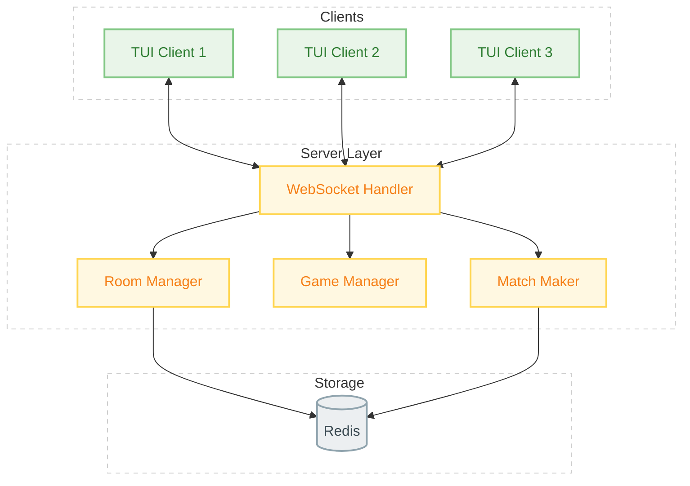
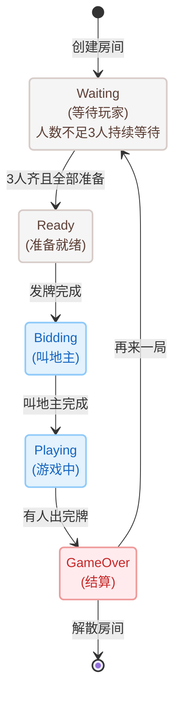
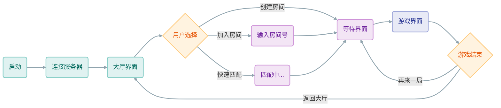

# Fight the Landlord

启动服务端

```
# 确保 Redis 在运行
redis-server
# 启动服务端 (默认端口 1780)
go run ./cmd/server
# 或使用自定义配置
go run ./cmd/server -config configs/config.yaml
```

启动客户端

```
# 连接本地服务器
go run ./cmd/client
# 连接远程服务器
go run ./cmd/client -server 192.168.1.100:1780
```






