<div align="center">
    

# 🎮 欢乐斗地主

**一个真正公平的斗地主游戏 - 无控牌、无算法操控、纯粹的运气与技巧**

基于 Go 语言实现的斗地主游戏，支持联网对战、断线重连、排行榜等功能。

</div>

## 💡 项目初衷

厌倦了商业斗地主游戏的控牌机制？我也是。

在某些知名斗地主游戏中，新手或回归玩家刚开始会获得好牌，匹配豆子少的对手，营造"连胜"的错觉。但随着游戏时间增长，牌质量明显下降，且频繁匹配高段位玩家，导致快速输光豆子。这种算法操控严重破坏了游戏的公平性和纯粹性。

**本项目承诺**：

- ✅ **真随机发牌**：使用 `crypto/rand` 加密级随机数，无任何控牌算法
- ✅ **公平匹配**：不考虑胜率、段位、游戏时长，纯随机或房间匹配
- ✅ **开源透明**：所有代码公开，欢迎审计和贡献
- ✅ **无内购无广告**：纯粹的游戏体验，技巧决定胜负

> **核心理念**：斗地主应该是运气与技巧的博弈，而不是算法与钱包的较量。

## 📸 游戏截图

<div align="center">
  
  
</div>

## ✨ 功能特性

| 功能        | 说明                                                   |
| ----------- | ------------------------------------------------------ |
| 🎯 实时对战 | WebSocket 实时通信，支持大规模并发对战（每局 3 人）    |
| 🏠 房间系统 | 创建房间、加入房间、快速匹配                           |
| 🔄 断线重连 | 网络波动时自动重连，游戏状态完整恢复                   |
| ⏸️ 离线等待 | 对手掉线时暂停计时，等待重连                           |
| 🏆 排行榜   | 积分系统、胜率统计、实时排名                           |
| 📲 聊天系统 | 支持大厅聊天、房间快捷消息，互动更便捷                 |
| 🔒 安全防护 | 来源验证、速率限制、IP 过滤                            |
| 🐳 容器部署 | Docker Compose 一键部署                                |
| 🔄 优雅升级 | 维护模式 + 零停机发版，等待游戏结束后自动关闭          |
| ⚡ 流量优化 | Protocol Buffers ~~+WebSocket~~ 压缩，节省 60-80% 流量 |
| 🚀 性能优化 | `sync.Pool` 对象池复用，降低 GC 压力，提升并发性能     |
| 📝 日志记录 | 文件记录日志，便于调试和问题追踪                       |

## 🚀 快速开始

### 客户端安装

**macOS / Linux**：

```bash
curl -fsSL https://raw.githubusercontent.com/palemoky/fight-the-landlord/main/install.sh | bash
```

**Windows (PowerShell)**：

```powershell
irm https://raw.githubusercontent.com/palemoky/fight-the-landlord/main/install.ps1 | iex
```

**运行客户端**：

```bash
fight-the-landlord
```

### 服务端部署

**使用 Docker Compose（推荐）**：

```bash
# 1. 创建项目目录
mkdir fight-the-landlord && cd fight-the-landlord

# 2. 下载配置文件
curl -fsSL https://raw.githubusercontent.com/palemoky/fight-the-landlord/main/docker-compose.yml -o docker-compose.yml
curl -fsSL https://raw.githubusercontent.com/palemoky/fight-the-landlord/main/.env.example -o .env

# 3. 修改配置（可选）
vim .env

# 4. 启动服务
docker compose up -d

# 5. 停止服务
docker compose down
```

💡 推荐使用 [lazydocker](https://github.com/jesseduffield/lazydocker) 管理服务

### 本地开发

```bash
# 1. 启动 Redis
redis-server

# 2. 启动服务端
go run ./cmd/server

# 3. 启动客户端（开 3 个终端）
go run ./cmd/client
```

## 🎲 游戏玩法

### 游戏操作

| 阶段   | 操作                                  |
| ------ | ------------------------------------- |
| 叫地主 | 输入 `Y` 叫地主，`N` 不叫             |
| 出牌   | 输入牌面，如 `33344`、`345678`、`JQK` |
| 不出   | 输入 `PASS` 或 `P`                    |

### 牌型示例

```
单张: 3, K, 2
对子: 33, KK
三张: 333
三带一: 3334
三带二: 33344
顺子: 34567 (5张+)
连对: 334455 (3对+)
飞机: 333444 (2连三+)
飞机带单: 33344456
飞机带对: 3334445566
四带二: 333345
四带两对: 33334455
炸弹: 3333
王炸: 小王大王
```

## 🏗️ 架构与流程

### 系统架构

```mermaid
graph TD
    subgraph Clients [客户端]
        C1[TUI Client 1]
        C2[TUI Client 2]
        C3[TUI Client 3]
    end

    subgraph Server [服务层]
        WH[WebSocket Handler]
        GM[Game Session]
        RM[Room Manager]
        MM[Match Maker]
        LB[Leaderboard]
    end

    subgraph Storage [存储]
        Redis[(Redis)]
    end

    C1 <--> WH
    C2 <--> WH
    C3 <--> WH

    WH --> RM
    WH --> GM
    WH --> MM
    WH --> LB

    RM --> Redis
    MM --> Redis
    LB --> Redis
```



### 游戏状态

```mermaid
stateDiagram-v2
    [*] --> Waiting : 创建/加入房间
    Waiting --> Ready : 3人齐且全部准备
    Ready --> Bidding : 发牌完成
    Bidding --> Playing : 地主确定
    Playing --> GameOver : 有人出完牌
    GameOver --> [*] : 解散
    GameOver --> Waiting : 再来一局
```



### 客户端流程

```mermaid
graph LR
    Start(启动):::setup
    Connect(连接服务器):::setup
    Lobby(大厅界面):::setup

    UserSelect{用户选择}:::decision

    Input(输入房间号):::process
    Matching(匹配中...):::process

    Waiting(等待界面):::process
    GameScreen(游戏界面):::game

    GameOver{游戏结束}:::decision

    %% --- 连接流程 ---
    %% 启动流程
    Start --> Connect --> Lobby --> UserSelect

    %% 分支流程
    UserSelect -- 创建房间 --> Waiting
    UserSelect -- 加入房间 --> Input --> Waiting
    UserSelect -- 快速匹配 --> Matching --> Waiting

    %% 游戏流程
    Waiting --> GameScreen --> GameOver

    %% 循环/返回流程
    GameOver -- 再来一局 --> Waiting
    GameOver -- 返回大厅 --> Lobby
```



## 🏆 积分规则

| 结果        | 积分 |
| ----------- | ---- |
| 地主胜利    | +30  |
| 农民胜利    | +15  |
| 地主失败    | -20  |
| 农民失败    | -10  |
| 3 连胜加成  | +5   |
| 5 连胜加成  | +10  |
| 10 连胜加成 | +20  |

## 🔐 公平性保证

### 真随机发牌

本项目使用 Go 标准库的 `crypto/rand` 包进行发牌，这是一个加密级随机数生成器（CSPRNG），其随机性质量远高于普通的伪随机数生成器。

**发牌流程**：

1. 创建 54 张牌的标准牌组
2. 使用 Fisher-Yates 洗牌算法 + `crypto/rand` 进行洗牌
3. 按顺序发牌：每位玩家 17 张，剩余 3 张作为底牌
4. **无任何基于玩家数据的牌面调整**

**代码位置**：`internal/game/deck.go`

```go
// 使用加密级随机数生成器洗牌
func shuffle(cards []Card) {
    for i := len(cards) - 1; i > 0; i-- {
        j := cryptoRandInt(i + 1)
        cards[i], cards[j] = cards[j], cards[i]
    }
}
```

### 公平匹配

**快速匹配**：

- 使用 Redis 队列实现先进先出（FIFO）匹配
- 不考虑玩家的胜率、段位、游戏时长、账户余额等任何因素
- 仅按照进入队列的时间顺序进行匹配

**房间匹配**：

- 玩家可自由创建或加入房间
- 完全由玩家控制，服务器不干预

**代码位置**：`internal/network/server/matcher.go`

### 开源审计

所有核心逻辑代码完全开源，欢迎社区审计：

- 发牌算法：`internal/game/deck.go`
- 匹配逻辑：`internal/network/server/matcher.go`
- 游戏规则：`internal/game/rules.go`

如果你发现任何可能影响公平性的代码，欢迎提交 Issue 或 Pull Request。

## Todo

- [ ] 使用 **GarageBand (库乐队)** 或其他音乐制作工具为游戏添加背景音乐和音效
- [ ] 等待 Docker Hardened Images 取消拉取验证和支持 debug 后，升级到 DHI
- [ ] 更加智能的 AI 出牌策略

## 鸣谢

- [Google Cloud Compute Engine](https://cloud.google.com/compute) 提供计算资源
- [Cloudflare](https://www.cloudflare.com/) 提供 CDN 服务
- [Flaticon](https://www.flaticon.com/) 提供游戏图标

## 🤝 贡献

欢迎贡献代码、报告问题或提出建议！

---

<div align="center">

**让斗地主回归纯粹 - 无控牌，真公平**

Made with ❤️ by [palemoky](https://github.com/palemoky)

</div>
